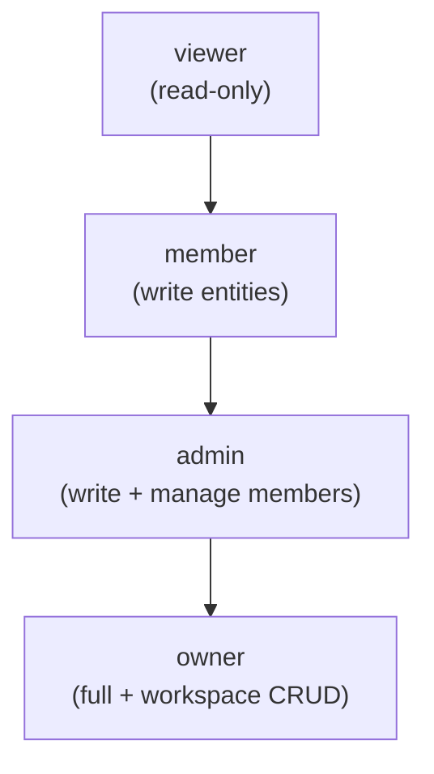

# PRD — User Personas: Bunkai TMS

> Discovery type: Reverse-engineering from source code (read-only).
> Generated: 2026-05-28
> Source repos: `/home/andreszz25/upex/upex-bunkai-tms/`
> Personas = system roles as found in code. No demographic archetypes invented.

---

## 1. Persona Discovery Summary

| Persona | System Role | Access Level | Primary Goal |
|---|---|---|---|
| Workspace Owner | `owner` | Full (write + admin + workspace management) | Bootstrap and govern the team's test workspace |
| QA Lead / Admin | `admin` | Write + member management (not workspace delete) | Manage team access; oversee ATC quality and coverage |
| QA Engineer / Dev Member | `member` | Write (create/edit/delete ATCs, stories, ACs, projects, modules) | Author ATCs that trace back to user stories |
| Reviewer / Stakeholder | `viewer` | Read-only across all entities | Observe test coverage and ATC status without modifying |
| API Consumer (machine) | PAT bearer (`atc:read`, `atc:write`, `run:execute`, `workspace:admin`) | Scope-specific, no UI | Read ATCs, report execution status, manage workspace via REST API |

Source: `lib/types.ts` MemberRole; `supabase/migrations/0001_tenancy.sql` `check (role in ('viewer','member','admin','owner'))`; `app/api/v1/tokens/route.ts` ALLOWED_SCOPES.

---

## 2. Per Persona

---

### Persona 1: Workspace Owner

**Identity**

| Field | Value | Evidence |
|---|---|---|
| System Role | `owner` | `lib/types.ts` line 13: `MemberRole = 'viewer' \| 'member' \| 'admin' \| 'owner'` |
| Assigned at | Workspace creation — always the user who called `bunkai_bootstrap_workspace` | `supabase/migrations/0001_tenancy.sql` policy: `check (auth.uid() = owner_user_id)` |
| Access Level | All write operations + workspace UPDATE/DELETE | `supabase/migrations/0005_rls_helpers.sql` `bunkai_is_workspace_owner` function |
| Estimated % of Users | ~5–15% (one per workspace) | Schema enforces one `owner_user_id` per workspace row |
| Auth Mode | Magic-link (cookie session); PAT with `workspace:admin` scope for automated ops | `app/(auth)/login/page.tsx`; `app/api/v1/tokens/route.ts` |

**Goals (Inferred from Features)**

| Goal | Supporting Feature | Route/Component |
|---|---|---|
| Create and name the team workspace | Onboarding wizard with slug auto-generation | `app/(app)/onboarding/page.tsx`; `app/(app)/onboarding/onboarding-form.tsx` |
| Bootstrap the first project and module structure | Projects page (currently empty-state placeholder) | `app/(app)/projects/page.tsx` line 52 "Phase E" |
| Issue PATs for CI/AI integration | PAT create/list/revoke API | `app/api/v1/tokens/route.ts` |
| Govern workspace membership | `workspace_members` RBAC | `supabase/migrations/0001_tenancy.sql` admin/owner policies |

**Pain Points (from Validation / Errors)**

| Pain Point | Evidence |
|---|---|
| Slug collision on workspace creation | `app/(app)/onboarding/onboarding-form.tsx` line 45: `error.code === '23505'` → toast: `Slug "${effectiveSlug}" is taken — try another.` |
| No member invite UI yet | `MemberStatus = 'invited'` exists in `lib/types.ts` line 14 but no invite route found in `app/` |
| Project creation UI not yet available | `app/(app)/projects/page.tsx` line 52: "Project creation UI ships in Phase E." |

**Feature Access**

| Feature | Access | Evidence |
|---|---|---|
| Workspace CRUD | Full | `bunkai_is_workspace_owner` guards UPDATE/DELETE on `workspaces` |
| Member management | Full (invite/suspend/reactivate) | `bunkai_is_workspace_admin` (owner satisfies admin check) |
| Project/Module/Story/ATC CRUD | Full | `bunkai_can_write_workspace` (owner satisfies write check) |
| PAT issuance | Full | `POST /api/v1/tokens` — any authenticated session user |
| Read all workspace data | Full | `bunkai_is_workspace_member` (owner satisfies member check) |

**User Journey Summary**

```
/login (email) -> magic link email -> /auth/callback -> /onboarding (workspace form) -> /projects
```

**Profile Attributes**

| Attribute | Source |
|---|---|
| `email` | Supabase `auth.users` — surfaced in `OnboardingForm` as `userEmail` prop |
| `workspace_id` | Set at `bunkai_bootstrap_workspace` — owner gets one workspace at creation |
| `role = 'owner'` | Hardcoded in `bunkai_bootstrap_workspace` RPC INSERT |

**Representative Quote** (inferred)
"I set up the workspace, defined the module structure, and issued a PAT for our CI pipeline — all without touching a Jira config." *(inferred)*

---

### Persona 2: QA Lead / Admin

**Identity**

| Field | Value | Evidence |
|---|---|---|
| System Role | `admin` | `lib/types.ts` line 13 MemberRole; `supabase/migrations/0001_tenancy.sql` |
| Access Level | Write + member management; cannot delete the workspace itself | `bunkai_is_workspace_admin` (admin + owner); `bunkai_is_workspace_owner` (owner only) for workspace DELETE |
| Estimated % of Users | ~10–20% of workspace members | Inferred — typically one or two leads per team |
| Auth Mode | Magic-link (cookie session) | `app/(auth)/login/page.tsx` |

**Goals (Inferred from Features)**

| Goal | Supporting Feature | Route/Component |
|---|---|---|
| Review team ATC coverage at a glance | ATC table with status, layer, module columns | `components/atcs/AtcTable.tsx` |
| Manage team member roles and status | `workspace_members` admin RBAC | `supabase/migrations/0001_tenancy.sql` admin policies |
| Define module hierarchy for a project | Sidebar tree explorer (read); module CREATE requires member+ access | `components/layout/Sidebar.tsx`; `supabase/migrations/0002_projects_modules.sql` |
| Issue PATs for CI/agentic tooling | PAT API | `app/api/v1/tokens/route.ts` |

**Pain Points (from Validation / Errors)**

| Pain Point | Evidence |
|---|---|
| No ATC coverage view / metrics dashboard | `AtcTable` shows list but no aggregated pass/fail/coverage summary component found |
| Cannot see test execution history | No `runs` table; `atcs.status` reflects last known state only |

**Feature Access**

| Feature | Access | Evidence |
|---|---|---|
| Workspace DELETE | None | `bunkai_is_workspace_owner` — admin is excluded |
| Member management (invite/suspend) | Full | `bunkai_is_workspace_admin` |
| Project/Module/Story/ATC CRUD | Full | `bunkai_can_write_workspace` |
| PAT issuance | Full | Session auth — any authenticated user |
| Workspace UPDATE | Full | `bunkai_is_workspace_admin` |

**User Journey Summary**

```
/login -> /projects (ATC table) -> sidebar module tree -> [atcId] editor -> save
```

**Representative Quote** (inferred)
"I need to know at a glance which ATCs are failing, which modules have zero coverage, and whether the CI PAT is still active." *(inferred)*

---

### Persona 3: QA Engineer / Developer Member

**Identity**

| Field | Value | Evidence |
|---|---|---|
| System Role | `member` | `lib/types.ts` line 13 MemberRole |
| Access Level | Write (create/edit/delete test entities); cannot manage workspace membership | `bunkai_can_write_workspace` = `role IN ('member','admin','owner')` |
| Estimated % of Users | ~60–70% of workspace members | Inferred — largest role group in a QA team |
| Auth Mode | Magic-link (cookie session) | `app/(auth)/login/page.tsx` |

**Goals (Inferred from Features)**

| Goal | Supporting Feature | Route/Component |
|---|---|---|
| Author ATCs with steps and assertions | Monaco editor (Markdown/YAML), step + assertion sections | `components/atcs/AtcEditor.tsx`; `components/atcs/StepEditor.tsx` |
| Link ATC to story and acceptance criteria | Anchoring panel with story search (Jira ID supported) | `components/atcs/AnchoringPanel.tsx` |
| Tag ATCs for filtering (regression, smoke, P1) | Tag input in editor (`Enter` to add, `×` to remove) | `components/atcs/AtcEditor.tsx` lines 278–307 |
| Classify ATCs by layer (UI/API/Unit) | Layer segmented control (UI/API/Unit) | `components/atcs/AtcEditor.tsx` lines 206–235 |
| Navigate the module tree to find ATCs | Sidebar collapsible tree with ATC status dots | `components/layout/Sidebar.tsx` |

**Pain Points (from Validation / Errors)**

| Pain Point | Evidence |
|---|---|
| Cannot save ATC without user story bound | `actions.ts` line 25–27: error `'Bind to a user story before saving.'`; tooltip in editor: "Pick a User Story to enable Save" |
| Cannot save ATC without ≥1 AC linked | `actions.ts` line 28–30: error `'Bind at least one acceptance criterion.'`; tooltip: "Bind at least one Acceptance Criterion to enable Save" |
| Title required to save | `actions.ts` line 31–33: error `'Title is required.'`; tooltip: "Add a title to enable Save" |
| Slug collision on workspace creation | `onboarding-form.tsx` line 45: SQLSTATE 23505 → friendly error toast |

**Feature Access**

| Feature | Access | Evidence |
|---|---|---|
| ATC create/read/edit/delete | Full | `bunkai_can_write_workspace` |
| User story + AC create/read/edit | Full | `supabase/migrations/0003_authoring.sql` write policies |
| Module create/read/edit | Full | `supabase/migrations/0002_projects_modules.sql` write policies |
| Workspace membership management | None | `bunkai_is_workspace_admin` excludes `member` role |
| Workspace UPDATE/DELETE | None | `bunkai_is_workspace_admin` / `bunkai_is_workspace_owner` excludes `member` |
| PAT issuance | Full (own tokens only) | `POST /api/v1/tokens` — cookie session, RLS enforces `user_id = auth.uid()` |

**User Journey Summary**

```
/login -> /projects/[slug] (ATC table) -> click "New ATC" -> [atcId] editor -> anchor to story/AC -> save
```

**Profile Attributes**

| Attribute | Source |
|---|---|
| `email` | Supabase `auth.users` |
| `role = 'member'` | Set by admin/owner at invite or direct INSERT |
| `status = 'active'` | Required for RLS pass-through (`bunkai_is_workspace_member` checks `status = 'active'`) |

**Representative Quote** (inferred)
"I write the ATC, paste the Jira ID into the story search, check the ACs it covers, write the steps in Markdown, drop in a YAML assertion list, and hit save. That's the whole loop." *(inferred)*

---

### Persona 4: API Consumer (Machine)

**Identity**

| Field | Value | Evidence |
|---|---|---|
| System Role | Not a workspace role — PAT bearer auth | `app/api/v1/tokens/route.ts` ALLOWED_SCOPES; `lib/api/middleware/bearer.ts` |
| Auth Mode | `Authorization: Bearer bk_pat_<prefix>.<secret>` | `supabase/migrations/0008_access_tokens.sql`; `lib/api/middleware/bearer.ts` |
| Access Level | Scope-gated: `atc:read` read; `atc:write` write; `run:execute` status update; `workspace:admin` admin ops | `app/api/v1/tokens/route.ts` line 23 ALLOWED_SCOPES |
| Estimated % of Users | Not a human user — represents CI pipeline, AI agent, or CLI tool | Inferred from design intent |
| Secret exposure | Returned ONCE at creation: `bk_pat_<prefix>.<secret>` — never retrievable | `app/api/v1/tokens/route.ts` line 84: `warning: 'Store this token now — it cannot be retrieved later.'` |

**Goals (Inferred from Features)**

| Goal | Supporting Feature | Route/Component |
|---|---|---|
| Read ATC list for a project | `atc:read` scope — PAT bearer on data endpoints | `lib/api/middleware/bearer.ts` `requireScope` |
| Update ATC execution status | `run:execute` scope — planned endpoint | `app/api/v1/tokens/route.ts` scope definition; no endpoint yet |
| Manage workspace resources programmatically | `workspace:admin` scope | `app/api/v1/tokens/route.ts` scope definition |
| List and revoke own PATs | `GET`/`DELETE /api/v1/tokens` (session-authenticated only) | `app/api/v1/tokens/route.ts`; `app/api/v1/tokens/[id]/route.ts` |

**Pain Points (from Validation / Errors)**

| Pain Point | Evidence |
|---|---|
| No data endpoints accept PAT bearer auth yet | `business-data-map.md` §9 note: "no routes currently use `requireBearerToken()` for data endpoints" |
| `run:execute` scope has no target endpoint | Flow 7 in `business-data-map.md`: "ENDPOINT NOT YET IMPLEMENTED" |
| Uniform 401 on auth failure — no diagnostic info | `lib/api/middleware/bearer.ts`: "never leak which check failed" |

**Feature Access**

| Feature | Access | Evidence |
|---|---|---|
| Health check | Full (no auth) | `app/api/v1/health/route.ts` |
| PAT issuance | None (requires cookie session) | `app/api/v1/tokens/route.ts`: "a PAT cannot create another PAT" |
| ATC read (when endpoint exists) | `atc:read` scope required | `lib/api/middleware/bearer.ts` `requireScope` |
| ATC write (when endpoint exists) | `atc:write` scope required | `app/api/v1/tokens/route.ts` ALLOWED_SCOPES |
| Execution status update | `run:execute` scope — endpoint not yet implemented | `supabase/migrations/0008_access_tokens.sql` scope |
| Workspace admin ops | `workspace:admin` scope — endpoint not yet implemented | `app/api/v1/tokens/route.ts` ALLOWED_SCOPES |

**User Journey Summary**

```
(Human) POST /api/v1/tokens (cookie session) -> receive bk_pat_... -> (Machine) GET /api/v1/... Bearer bk_pat_... -> data
```

**Representative Quote** (inferred)
"I'm a GitHub Actions workflow. I read the ATCs for the sprint, execute them via Playwright, and post back pass/fail status." *(inferred)*

---

## 3. Role Hierarchy



Source: `supabase/migrations/0005_rls_helpers.sql` — each helper function is a superset of the previous:
- `bunkai_is_workspace_member` — active status (all roles)
- `bunkai_can_write_workspace` — active + role IN (member, admin, owner)
- `bunkai_is_workspace_admin` — active + role IN (admin, owner)
- `bunkai_is_workspace_owner` — active + role = owner

---

## 4. Permission Matrix

| Permission | viewer | member | admin | owner |
|---|---|---|---|---|
| Read workspace data (projects, modules, stories, ATCs) | ✓ | ✓ | ✓ | ✓ |
| Create/edit/delete ATCs | ✗ | ✓ | ✓ | ✓ |
| Create/edit/delete user stories + ACs | ✗ | ✓ | ✓ | ✓ |
| Create/edit/delete projects + modules | ✗ | ✓ | ✓ | ✓ |
| Invite / suspend workspace members | ✗ | ✗ | ✓ | ✓ |
| Update workspace name/slug | ✗ | ✗ | ✓ | ✓ |
| Delete workspace | ✗ | ✗ | ✗ | ✓ |
| Issue own PATs | ✓ (cookie auth) | ✓ (cookie auth) | ✓ (cookie auth) | ✓ (cookie auth) |

Source: `supabase/migrations/0001_tenancy.sql` RLS policies; `supabase/migrations/0005_rls_helpers.sql` helper functions; `app/api/v1/tokens/route.ts` `createClient()` session check.

Note: PAT issuance requires a cookie session — all logged-in users can issue tokens regardless of workspace role. RLS on `access_tokens` enforces `user_id = auth.uid()` (own tokens only).

---

## 5. Discovery Gaps

| Gap | Why It Matters | Question to Ask |
|---|---|---|
| No role-gating in UI components | `AtcTable` and `AtcEditor` render the same UI regardless of caller's role; mutations are blocked by RLS, not by UI guards | Are there plans to hide/disable the "New ATC" button for `viewer` role users? |
| No team invitation UI found | `MemberStatus = 'invited'` exists in schema and types but no invite send/accept route exists in `app/` | Is invitation via DB insert only for now, or is the invite flow planned for a specific phase? |
| `viewer` role behavior not tested in UI code | No `role === 'viewer'` conditional found in any `.tsx` component; viewers see the full UI but writes are blocked by RLS | Confirm that "viewer sees full UI but cannot mutate" is the intended UX |
| PAT bearer auth not wired to any data endpoint | `requireBearerToken` exists in `lib/api/middleware/bearer.ts` but is not imported by any current route handler | When will `GET /api/v1/atcs` and `PATCH /api/v1/atcs/*/status` be implemented? |
| `workspace:admin` PAT scope — no endpoint defined | Scope exists in token issuance but no route uses it | What workspace operations will this scope gate in the API? |
| User profile fields beyond email | Only `auth.users.email` surfaces in the UI (`OnboardingForm` `userEmail` prop); no display name, avatar, or profile page found | Is user profile management (name, avatar) planned? |

---

## 6. QA Relevance

### Test Account Requirements

| Persona | Test Account | Permissions Needed | .env Key |
|---|---|---|---|
| Workspace Owner | Email registered in Supabase Auth; owns a test workspace | `role = 'owner'`, `status = 'active'` | `LOCAL_USER_EMAIL` + `SUPABASE_SERVICE_ROLE_KEY` (for session injection) |
| QA Lead / Admin | Second email in same workspace | `role = 'admin'`, `status = 'active'` | `LOCAL_USER_EMAIL` (second account) |
| QA Engineer / Member | Third email in same workspace | `role = 'member'`, `status = 'active'` | `LOCAL_USER_EMAIL` (third account) |
| Viewer / Stakeholder | Fourth email in same workspace | `role = 'viewer'`, `status = 'active'` | `LOCAL_USER_EMAIL` (fourth account) |
| API Consumer | Any user's PAT with specific scopes | `atc:read`, `run:execute` issued via `POST /api/v1/tokens` | PAT stored in `.env` as `TEST_PAT_ATC_READ`, `TEST_PAT_RUN_EXECUTE` (names TBD per convention) |

Source for key names: `.context/project-config.md` env checklist; `supabase/migrations/0008_access_tokens.sql` for PAT design.

### Critical Persona Flows to Test

| Flow | Persona | Priority |
|---|---|---|
| Magic link → onboarding → workspace created as `owner` | Owner | P0 |
| Member authors ATC, anchors to story+AC, saves (version bumps) | Member | P0 |
| Viewer cannot save ATC (RLS blocks mutation) | Viewer | P0 |
| Member cannot invite/suspend other members (403 expected) | Member | P1 |
| Admin can change member role; owner can delete workspace | Admin + Owner | P1 |
| PAT with `atc:read` can read; PAT without `atc:write` cannot write | API Consumer | P1 |
| Revoked PAT returns 401 uniformly | API Consumer | P0 |

### Edge Cases by Persona

| Persona | Edge Case | Expected Behavior | Evidence |
|---|---|---|---|
| Owner | Workspace slug already taken | `toast.error('Slug "..." is taken — try another.')` | `onboarding-form.tsx` line 45 |
| Member | Save ATC with empty `acIds` | `{ ok: false, error: 'Bind at least one acceptance criterion.' }` | `actions.ts` line 28 |
| Member | Save ATC with empty title | `{ ok: false, error: 'Title is required.' }` | `actions.ts` line 32 |
| Member | Create module at depth 7 | PostgreSQL CHECK constraint failure (HTTP 400/500) | `supabase/migrations/0002_projects_modules.sql` CHECK |
| Viewer | Attempt any mutation via API | RLS returns empty result or PostgreSQL RLS violation (surfaced as 400) | `supabase/migrations/0005_rls_helpers.sql` |
| API Consumer | Use expired PAT | Uniform 401 — `expires_at < now()` check in `bearer.ts` | `lib/api/middleware/bearer.ts` |
| API Consumer | Use `run:execute` scope | No endpoint exists yet — will return 404 or 405 | `business-data-map.md` Flow 7 |
| Any | OTP code missing in callback URL | Redirect to `/login?error=missing_code` | `app/auth/callback/route.ts` line 21 |
| Any | OTP exchange fails (expired/used link) | Redirect to `/login?error=otp_exchange_failed&reason=<encoded>` | `app/auth/callback/route.ts` line 28 |
