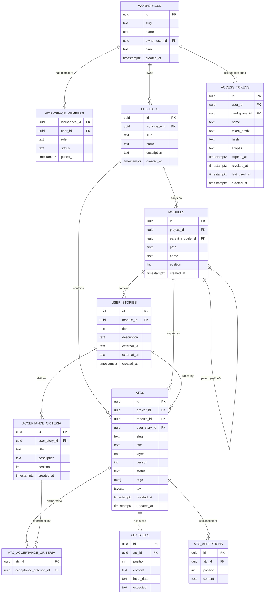
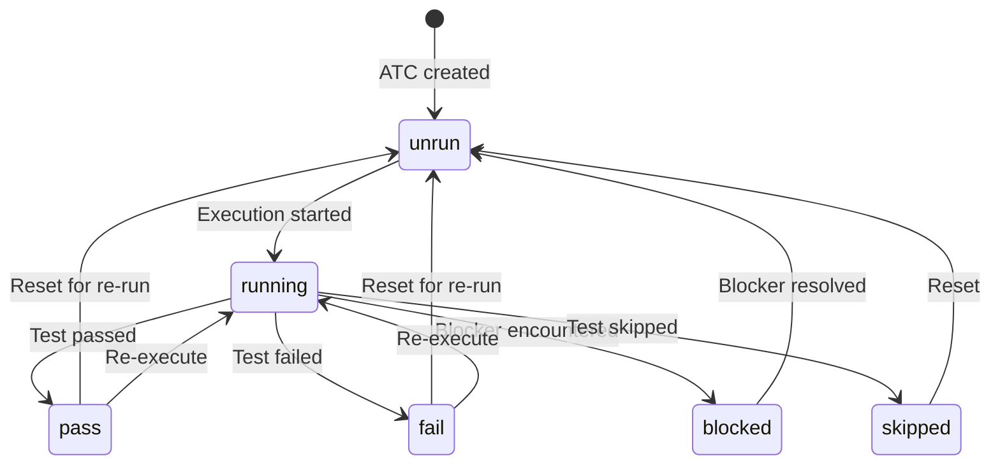
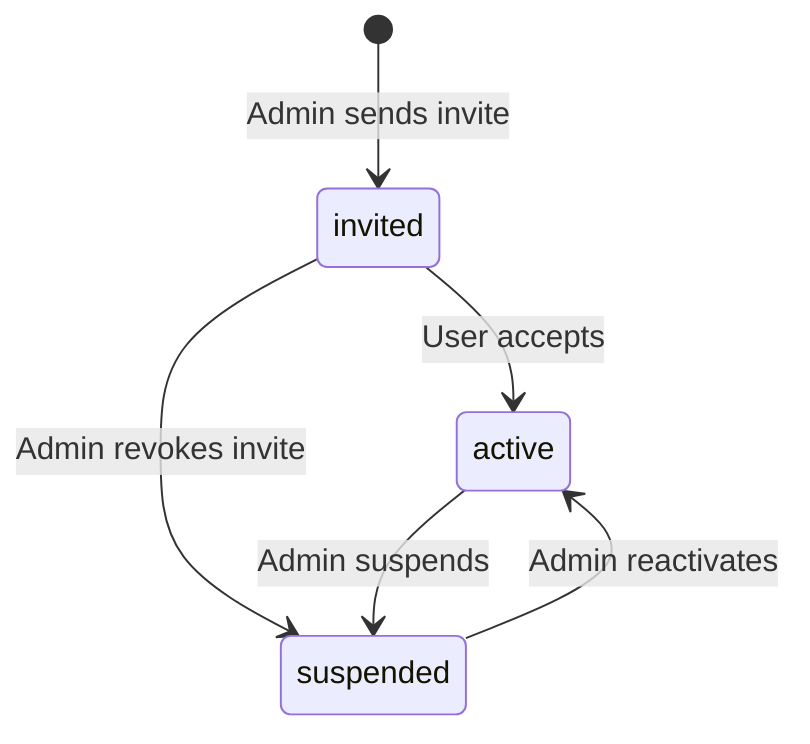
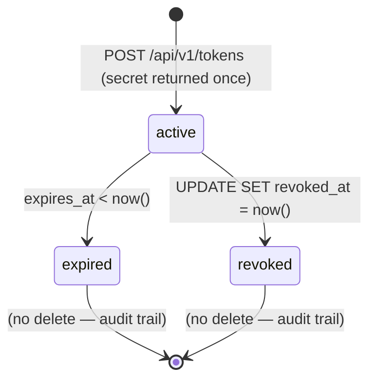

# Domain Glossary — Bunkai TMS

> Generated: 2026-05-25  
> Source: /project-discovery Phase 1  
> Primary sources: `supabase/migrations/` (authoritative schema), `lib/types.ts`, `app/` routes

---

## 1. Core Entities

### Workspace

| Field | Type | Description |
|---|---|---|
| Technical Name | `workspaces` | PostgreSQL table |
| Business Name | Workspace | Tenant / organization boundary |
| Description | Root multi-tenant container. Every downstream entity resolves to one workspace. |
| Table/Collection | `public.workspaces` |
| Key Attributes | `id` (uuid PK), `slug` (text unique), `name`, `owner_user_id` (FK → auth.users), `plan` (community\|cloud\|enterprise), `created_at` |

**Relationships:**
- Has many `workspace_members` (RBAC join table)
- Has many `projects` (scoped to workspace)
- Has many `access_tokens` (workspace-scoped PATs — optional; NULL workspace_id = global)

**Business Rules:**
- Only the owner can update or delete the workspace
- Owner is set at INSERT time via `check (auth.uid() = owner_user_id)`
- Plan tiers: `community`, `cloud`, `enterprise` (enforcement logic not yet implemented in app code as of discovery)

**JSON Example:**
```json
{
  "id": "550e8400-e29b-41d4-a716-446655440000",
  "slug": "upex-team",
  "name": "UPEX Team",
  "owner_user_id": "auth-user-uuid",
  "plan": "community",
  "created_at": "2026-05-19T10:00:00Z"
}
```

Source: `supabase/migrations/0001_tenancy.sql`; `lib/types.ts` WorkspacePlan

---

### WorkspaceMember

| Field | Type | Description |
|---|---|---|
| Technical Name | `workspace_members` | PostgreSQL table (composite PK) |
| Business Name | Workspace Member / Team Member | RBAC join between user and workspace |
| Description | Controls which users can access a workspace and with what permissions |
| Table/Collection | `public.workspace_members` |
| Key Attributes | `workspace_id` (FK), `user_id` (FK → auth.users), `role` (viewer\|member\|admin\|owner), `status` (active\|invited\|suspended), `joined_at` |

**Relationships:**
- Belongs to one `workspace`
- References one `auth.users` record

**Business Rules:**
- Active membership required for any data access (`status = 'active'`)
- Mutations on other members require `role IN ('admin','owner')`
- `viewer` role is read-only across all tables
- `member`, `admin`, `owner` roles can create/update/delete test entities
- No self-service suspension: must be performed by admin/owner

**JSON Example:**
```json
{
  "workspace_id": "workspace-uuid",
  "user_id": "user-uuid",
  "role": "member",
  "status": "active",
  "joined_at": "2026-05-20T08:30:00Z"
}
```

Source: `supabase/migrations/0001_tenancy.sql`; `lib/types.ts` MemberRole, MemberStatus

---

### Project

| Field | Type | Description |
|---|---|---|
| Technical Name | `projects` | PostgreSQL table |
| Business Name | Project | Application Under Test (AUT) — the software being quality-tested |
| Description | A software application or product whose ATCs live in Bunkai. Scoped to one workspace. |
| Table/Collection | `public.projects` |
| Key Attributes | `id` (uuid PK), `workspace_id` (FK), `slug` (unique within workspace), `name`, `description`, `created_at` |

**Relationships:**
- Belongs to one `workspace`
- Has many `modules` (hierarchical tree)
- Has many `atcs` (all ATCs for this project)

**Business Rules:**
- Slug unique per workspace: `UNIQUE (workspace_id, slug)`
- Requires `role IN ('member','admin','owner')` to create/update/delete

**JSON Example:**
```json
{
  "id": "project-uuid",
  "workspace_id": "workspace-uuid",
  "slug": "bunkai-tms",
  "name": "Bunkai TMS",
  "description": "Test management system itself",
  "created_at": "2026-05-19T10:00:00Z"
}
```

Source: `supabase/migrations/0002_projects_modules.sql`; `lib/types.ts` Project

---

### Module

| Field | Type | Description |
|---|---|---|
| Technical Name | `modules` | PostgreSQL table |
| Business Name | Module / Test Module | Organizational folder in the test hierarchy |
| Description | Self-referential tree (max depth 6) for organizing user stories and ATCs within a project |
| Table/Collection | `public.modules` |
| Key Attributes | `id` (uuid PK), `project_id` (FK), `parent_module_id` (FK self-referential, nullable), `path` (slash-separated materialized path), `name`, `position` (int sort order), `created_at` |

**Relationships:**
- Belongs to one `project`
- Self-references as tree: has optional `parent_module_id`
- Has many `user_stories`
- Has many `atcs`

**Business Rules:**
- Maximum depth of 6 levels enforced by CHECK constraint: `array_length(string_to_array(path, '/'), 1) BETWEEN 1 AND 6`
- Path is unique per project: `UNIQUE (project_id, path)`
- `position` field controls sibling sort order in the tree view

**JSON Example:**
```json
{
  "id": "module-uuid",
  "project_id": "project-uuid",
  "parent_module_id": null,
  "path": "authentication",
  "name": "Authentication",
  "position": 0,
  "created_at": "2026-05-19T10:00:00Z"
}
```

Source: `supabase/migrations/0002_projects_modules.sql`; `lib/types.ts` Module

---

### UserStory

| Field | Type | Description |
|---|---|---|
| Technical Name | `user_stories` | PostgreSQL table |
| Business Name | User Story / Story | Unit of business intent from the backlog |
| Description | Represents a Jira/backlog user story anchored to a module. Contains the business requirement that ATCs must trace back to. |
| Table/Collection | `public.user_stories` |
| Key Attributes | `id` (uuid PK), `module_id` (FK), `title`, `description`, `external_id` (Jira issue key, e.g. BK-42), `external_url` (Jira URL), `created_at` |

**Relationships:**
- Belongs to one `module`
- Has many `acceptance_criteria` (1:N)
- Has many `atcs` (1:N — each ATC references one user_story)

**Business Rules:**
- `external_id` and `external_url` link to Jira issue (optional but recommended for traceability)
- Deletion cascades to acceptance_criteria; ATCs use `ON DELETE RESTRICT` — a story with ATCs cannot be deleted

**JSON Example:**
```json
{
  "id": "story-uuid",
  "module_id": "module-uuid",
  "title": "As a QA engineer, I can create an ATC linked to an AC",
  "description": "Full story description...",
  "external_id": "BK-42",
  "external_url": "https://upexgalaxy67.atlassian.net/browse/BK-42",
  "created_at": "2026-05-19T10:00:00Z"
}
```

Source: `supabase/migrations/0003_authoring.sql`; `lib/types.ts` UserStory

---

### AcceptanceCriterion

| Field | Type | Description |
|---|---|---|
| Technical Name | `acceptance_criteria` | PostgreSQL table |
| Business Name | Acceptance Criterion / AC | A single testable condition that defines when a story is complete |
| Description | Sortable, numbered criteria attached to a user story. ATCs must reference ≥1 AC (the anchoring moat). |
| Table/Collection | `public.acceptance_criteria` |
| Key Attributes | `id` (uuid PK), `user_story_id` (FK), `title`, `description`, `position` (int — sort order unique per story), `created_at` |

**Relationships:**
- Belongs to one `user_story`
- Referenced by many `atcs` via `atc_acceptance_criteria` (M:N)

**Business Rules:**
- `UNIQUE (user_story_id, position)` — no two ACs at same position in a story
- `position` drives display order in the editor
- At least one AC must be linked to each ATC (enforced at application layer in MVP, structural via FK)

**JSON Example:**
```json
{
  "id": "ac-uuid",
  "user_story_id": "story-uuid",
  "title": "ATC editor shows validation error when no AC is selected",
  "description": null,
  "position": 0,
  "created_at": "2026-05-19T10:00:00Z"
}
```

Source: `supabase/migrations/0003_authoring.sql`; `lib/types.ts` AcceptanceCriterion

---

### ATC (Acceptance Test Case)

| Field | Type | Description |
|---|---|---|
| Technical Name | `atcs` | PostgreSQL table |
| Business Name | ATC — Acceptance Test Case | The fundamental test unit in Bunkai |
| Description | A single observable, executable test behaviour. Must be linked to ≥1 AC (anchoring moat). Carries layer classification, status lifecycle, tags, and full-text search index. |
| Table/Collection | `public.atcs` |
| Key Attributes | `id` (uuid PK), `project_id` (FK), `module_id` (FK), `user_story_id` (FK), `slug` (unique per project), `title`, `layer` (UI\|API\|Unit), `version` (int, bumps on every save), `status` (pass\|fail\|blocked\|skipped\|running\|unrun), `tags` (text[]), `tsv` (tsvector for FTS), `created_at`, `updated_at` |

**Relationships:**
- Belongs to one `project`, one `module`, one `user_story`
- Has many `atc_steps` (ordered procedure steps)
- Has many `atc_assertions` (expected outcomes)
- Links to many `acceptance_criteria` via `atc_acceptance_criteria` (M:N)

**Business Rules:**
- Slug unique per project: `UNIQUE (project_id, slug)`
- Layer must be exactly `'UI'`, `'API'`, or `'Unit'`
- Status must be one of: `pass`, `fail`, `blocked`, `skipped`, `running`, `unrun`
- `version` increments on every save via `bunkai_save_atc` RPC
- FTS index on `title + tags` array (GIN index `atcs_tsv_gin_idx`)
- `updated_at` auto-maintained by `bunkai_set_updated_at` trigger

**JSON Example:**
```json
{
  "id": "atc-uuid",
  "project_id": "project-uuid",
  "module_id": "module-uuid",
  "user_story_id": "story-uuid",
  "slug": "ATC-001",
  "title": "Login with valid magic link redirects to /projects",
  "layer": "UI",
  "version": 3,
  "status": "pass",
  "tags": ["auth", "smoke"],
  "created_at": "2026-05-20T09:00:00Z",
  "updated_at": "2026-05-22T14:30:00Z"
}
```

Source: `supabase/migrations/0004_atcs.sql`; `lib/types.ts` Atc, AtcLayer, AtcStatus

---

### AtcStep

| Field | Type | Description |
|---|---|---|
| Technical Name | `atc_steps` | PostgreSQL table |
| Business Name | ATC Step | A single action in the ATC procedure |
| Description | Ordered steps that describe what to do in the test. Each step may carry input data and expected outcome text. |
| Table/Collection | `public.atc_steps` |
| Key Attributes | `id` (uuid PK), `atc_id` (FK → atcs), `position` (int), `content` (step description), `input_data` (optional), `expected` (optional expected result) |

**Relationships:**
- Belongs to one `atc`
- Steps are fully replaced on each ATC save (delete-then-insert via `bunkai_save_atc`)

**Business Rules:**
- `UNIQUE (atc_id, position)` — ordered, no gaps enforced at application layer
- Children are fully replaced (not diffed) on ATC save

Source: `supabase/migrations/0004_atcs.sql`; `lib/types.ts` AtcStep

---

### AtcAssertion

| Field | Type | Description |
|---|---|---|
| Technical Name | `atc_assertions` | PostgreSQL table |
| Business Name | ATC Assertion | An expected outcome / pass condition |
| Description | One or more verifiable outcomes that define when the ATC passes. Separate from steps. |
| Table/Collection | `public.atc_assertions` |
| Key Attributes | `id` (uuid PK), `atc_id` (FK), `position` (int), `content` (assertion text) |

**Relationships:**
- Belongs to one `atc`
- Fully replaced on each ATC save

**Business Rules:**
- `UNIQUE (atc_id, position)`
- Ordered list; position drives display order

Source: `supabase/migrations/0004_atcs.sql`; `lib/types.ts` AtcAssertion

---

### AtcAcceptanceCriterion (M:N Junction)

| Field | Type | Description |
|---|---|---|
| Technical Name | `atc_acceptance_criteria` | PostgreSQL table (composite PK) |
| Business Name | ATC–AC Link / Anchoring Moat | Traceability link between ATC and its parent acceptance criteria |
| Description | M:N join table enforcing that every ATC traces back to at least one AC from the parent story |
| Table/Collection | `public.atc_acceptance_criteria` |
| Key Attributes | `atc_id` (FK), `acceptance_criterion_id` (FK) — composite PK |

**Business Rules:**
- Must have ≥1 row per ATC (application-layer enforcement in MVP)
- Fully replaced on each ATC save via `bunkai_save_atc`
- This is the "anchoring moat" — ATCs without AC linkage are incomplete

Source: `supabase/migrations/0004_atcs.sql`

---

### AccessToken (PAT)

| Field | Type | Description |
|---|---|---|
| Technical Name | `access_tokens` | PostgreSQL table |
| Business Name | Personal Access Token / PAT | Bearer token for CLI, AI agents, CI pipelines |
| Description | Long-lived bearer tokens issued to users for non-session API access. Scoped permissions, soft-delete only. |
| Table/Collection | `public.access_tokens` |
| Key Attributes | `id` (uuid PK), `user_id` (FK), `workspace_id` (FK, nullable = global), `name`, `token_prefix` (first 12 chars, indexed), `hash` (SHA-256 of secret), `scopes` (text[]), `expires_at`, `revoked_at`, `last_used_at`, `created_at` |

**Relationships:**
- Belongs to one `auth.users`
- Optionally scoped to one `workspace`

**Business Rules:**
- Secret returned ONCE at creation as `bk_pat_<prefix>.<secret>` — never stored in plaintext
- Only `hash` (SHA-256) stored in DB
- Allowed scopes: `atc:read`, `atc:write`, `run:execute`, `workspace:admin`
- Revocation via `UPDATE SET revoked_at = now()` — NO hard delete (audit trail preserved)
- Token rejected if `revoked_at IS NOT NULL` OR `expires_at < now()`
- Global tokens have `workspace_id = NULL`

**JSON Example (response, redacted):**
```json
{
  "id": "token-uuid",
  "user_id": "user-uuid",
  "workspace_id": "workspace-uuid",
  "name": "CI pipeline token",
  "token_prefix": "abc123def456",
  "scopes": ["atc:read", "run:execute"],
  "expires_at": "2027-05-25T00:00:00Z",
  "revoked_at": null,
  "created_at": "2026-05-25T10:00:00Z"
}
```

Source: `supabase/migrations/0008_access_tokens.sql`; `app/api/v1/tokens/route.ts`

---

## 2. Enumerations and Constants

### WorkspacePlan
```typescript
// Source: lib/types.ts + supabase/migrations/0001_tenancy.sql
type WorkspacePlan = 'community' | 'cloud' | 'enterprise'
```

### MemberRole
```typescript
// Source: lib/types.ts + supabase/migrations/0001_tenancy.sql
// viewer = read-only; member/admin/owner = write access
type MemberRole = 'viewer' | 'member' | 'admin' | 'owner'
```

### MemberStatus
```typescript
// Source: lib/types.ts + supabase/migrations/0001_tenancy.sql
type MemberStatus = 'active' | 'invited' | 'suspended'
```

### AtcLayer
```typescript
// Source: lib/types.ts + supabase/migrations/0004_atcs.sql
// Classifies test automation layer — matches KATA architecture
type AtcLayer = 'UI' | 'API' | 'Unit'
```

### AtcStatus
```typescript
// Source: lib/types.ts + supabase/migrations/0004_atcs.sql
type AtcStatus = 'pass' | 'fail' | 'blocked' | 'skipped' | 'running' | 'unrun'
```

### PAT Scopes (API constants)
```typescript
// Source: app/api/v1/tokens/route.ts
const ALLOWED_SCOPES = ['atc:read', 'atc:write', 'run:execute', 'workspace:admin'] as const
```

### ApiErrorCodes
```typescript
// Source: lib/api/error-envelope.ts
// BAD_REQUEST, VALIDATION_FAILED, UNAUTHORIZED, FORBIDDEN, NOT_FOUND,
// METHOD_NOT_ALLOWED, CONFLICT, IDEMPOTENCY_KEY_REQUIRED, IDEMPOTENCY_KEY_INVALID,
// RATE_LIMITED, INTERNAL_ERROR, UPSTREAM_ERROR
```

---

## 3. Business Rules

| Rule | Location | Description |
|---|---|---|
| ATC must reference ≥1 AC | `supabase/migrations/0004_atcs.sql` comment; `app/api/v1/` | Anchoring moat — enforced at app layer in MVP |
| Module depth ≤ 6 | `supabase/migrations/0002_projects_modules.sql` CHECK constraint | `array_length(string_to_array(path, '/'), 1) BETWEEN 1 AND 6` |
| ATC slug unique per project | `supabase/migrations/0004_atcs.sql` UNIQUE constraint | `UNIQUE (project_id, slug)` |
| AC position unique per story | `supabase/migrations/0003_authoring.sql` UNIQUE constraint | `UNIQUE (user_story_id, position)` |
| ATC version bumps on save | `supabase/migrations/0007_save_atc.sql` | `version = version + 1` in `bunkai_save_atc` RPC |
| PAT revocation is soft-delete only | `supabase/migrations/0008_access_tokens.sql` comment | No DELETE RLS policy — audit trail preserved |
| PAT scopes non-empty | `supabase/migrations/0008_access_tokens.sql` CHECK | `array_length(scopes, 1) >= 1` |
| PAT scopes validated | `supabase/migrations/0008_access_tokens.sql` CHECK | `scopes <@ array['atc:read','atc:write','run:execute','workspace:admin']` |
| Workspace owner set at INSERT | `supabase/migrations/0001_tenancy.sql` policy | `check (auth.uid() = owner_user_id)` |
| Story deletion blocked if ATCs exist | `supabase/migrations/0004_atcs.sql` FK | `user_story_id FK ON DELETE RESTRICT` |
| Env vars validated at server startup | `lib/env.ts` | Zod schema throws on invalid/missing vars |

---

## 4. Entity Relationships Diagram



Source: `supabase/migrations/0001_tenancy.sql` through `0008_access_tokens.sql`

---

## 5. Terminology Mapping

| Technical Term | Business Term | Description |
|---|---|---|
| `atcs` | Acceptance Test Case / ATC | Core test unit |
| `atc_steps` | Test Steps | Procedure instructions in an ATC |
| `atc_assertions` | Assertions / Pass Conditions | Expected outcomes |
| `atc_acceptance_criteria` | AC Links / Anchoring Moat | Traceability M:N join |
| `user_stories` | User Story / Story | Business requirement from backlog |
| `acceptance_criteria` | Acceptance Criterion / AC | Testable condition on a story |
| `modules` | Module / Test Folder | Hierarchical organizer within a project |
| `projects` | Project | Application Under Test (AUT) |
| `workspaces` | Workspace / Team | Tenant boundary |
| `workspace_members` | Team Member | User with role in a workspace |
| `access_tokens` | Personal Access Token / PAT | Bearer token for API auth |
| `layer` | Test Layer | UI, API, or Unit classification |
| `status` | Test Status | pass/fail/blocked/skipped/running/unrun |
| `tsv` | Search Index | PostgreSQL tsvector for full-text search |
| `slug` | Identifier / Short ID | Human-readable URL-safe ID |
| `external_id` | Jira Issue Key | e.g. BK-42 |
| `external_url` | Jira Issue URL | Link to source Jira ticket |
| `bunkai_save_atc` | Save ATC RPC | Atomic transactional ATC update |
| `bk_pat_` | Token Family Prefix | PAT format prefix for secret scanning |

### Abbreviations

| Abbreviation | Full Form |
|---|---|
| ATC | Acceptance Test Case |
| AC | Acceptance Criterion |
| PAT | Personal Access Token |
| IQL | Integrated Quality Lifecycle |
| KATA | Komponent Action Test Architecture |
| RLS | Row-Level Security |
| TMS | Test Management System |
| AUT | Application Under Test |
| FTS | Full-Text Search |

---

## 6. Status / State Flows

### ATC Status Flow



Source: `supabase/migrations/0004_atcs.sql` status check constraint; `lib/types.ts` AtcStatus

### Workspace Member Status Flow



Source: `supabase/migrations/0001_tenancy.sql` status check constraint; `lib/types.ts` MemberStatus

### PAT Lifecycle



Source: `supabase/migrations/0008_access_tokens.sql`; `app/api/v1/tokens/route.ts`

---

## 7. Discovery Gaps

| Gap | Severity | Notes |
|---|---|---|
| No `runs` or `test_executions` table found | HIGH | PAT has `run:execute` scope but no DB table for storing execution results — likely a planned feature |
| No `defects` or `bugs` table found | MEDIUM | IQL methodology includes defect linkage but no schema found |
| Module `path` format and generation logic not verified | LOW | Path format inferred as slash-separated (e.g. "auth/login") from CHECK constraint; actual generation logic not inspected |
| `bootstrapWorkspace` function in migration 0006 not fully read | LOW | Only first 2KB of migration 0005+0006 previewed; 0006 bootstrap logic may create seed data |
| Supabase type file (`lib/types/supabase.ts`) not read | MEDIUM | Auto-generated Supabase types not inspected; may differ from hand-written `lib/types.ts` |

---

## 8. QA Usage Guide

This glossary is the single source of truth for entity names in all test artifacts.

**Naming conventions for tests:**
- Use `atc` (lowercase) for variable names; `ATC` when referring to the concept
- Use `workspace`, `project`, `module`, `story`, `ac` as variable prefixes in test fixtures
- Use exact status values from `AtcStatus` enum when asserting states: `'pass'`, `'fail'`, `'blocked'`, `'skipped'`, `'running'`, `'unrun'`
- Use exact layer values: `'UI'`, `'API'`, `'Unit'` (case-sensitive, uppercase)
- Use exact role values: `'viewer'`, `'member'`, `'admin'`, `'owner'` (lowercase)

**Test data hierarchy (from root to leaf):**
```
workspace → project → module → user_story → acceptance_criterion
                                    ↓                ↓
                              atc (slug, layer, status)
                               ├── atc_steps[]
                               ├── atc_assertions[]
                               └── atc_acceptance_criteria[ac_id, ...]
```

**Key invariants to test:**
1. ATC without any `atc_acceptance_criteria` link → should be invalid (app-layer enforcement)
2. Module path depth 7 → should be rejected (DB CHECK constraint)
3. Revoked PAT → should return 401
4. `viewer` role attempting any mutation → should return 403
5. `version` increments on every `bunkai_save_atc` call
6. `atc_steps` fully replaced (not merged) on ATC save
